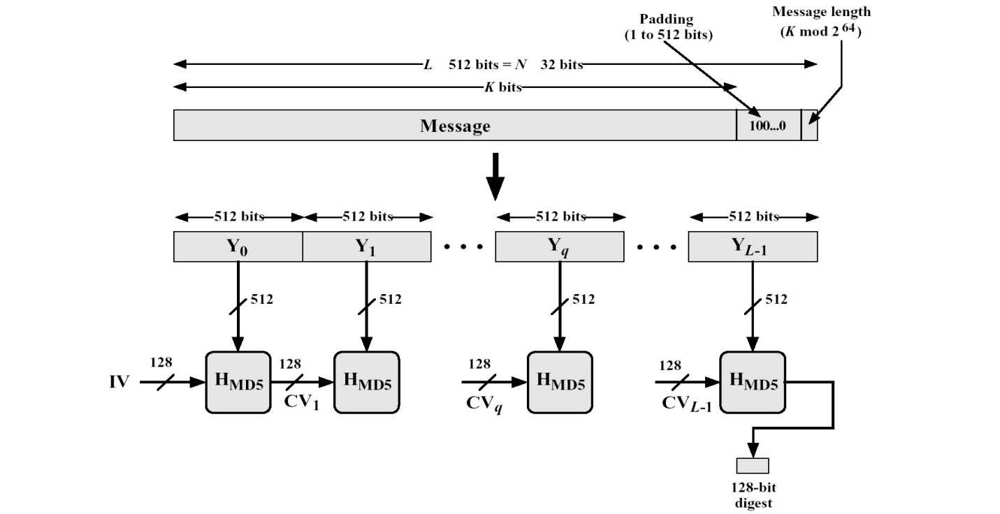
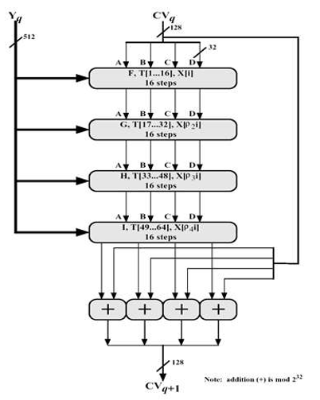
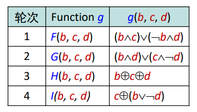
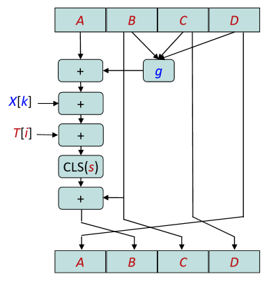

# MD5 算法

## 算法原理概述

 MD5 使用 little-endian(小端模式)，输入任意不定长度信息，以 512-bit 进行分组，生成四个32-bit 数据，最后联合输出固定 128-bit 的信息摘要。

MD5 算法的基本过程为：填充、分块、缓冲区初始化、循环压缩、得出结果。 

填充：输入长度为 K bits 的原始消息数据，填充 P bits 的标识和 64 bits 的消息长度消息。

分块：将填充后的消息分割成 L 个 512 bits 的分组。

缓冲区初始化：初始化一个 128 bits 的 MD 缓冲区，表示成 4 个 32 bits 的寄存器（A，B，C，D）。

循环压缩：将循环压缩函数依次作用于缓冲区数据和消息的每一个分组，最后得出结果。

## 总体结构

以 512 bits 消息分组为单位，每一分组经过 4 个循环的压缩算法，表示为：
$$
\begin{align}
CV_0 &= IV\\
CV_i &= H_{MD5}(CV_{i-1}, Y_i)
\end{align}
$$
输出结果：
$$
MD = CV_L
$$




## 模块分解

### 数据填充

最后作用于压缩函数的消息是以 512 bit 为分组的，原始消息 (K bits) 加上填充字段 (P bits) 和尾部填充的数据长度消息 (64 bits) 的总长度最终是 512 的倍数，即：
$$
K+P+64 \equiv 0 \ (mod\ \  512) \\
K+P \equiv 448 \ (mod\ \  512)
$$
填充的字段是 1000, 0000, ...，二进制首位为 1，其余为 0。最后 64 位加上原始消息的长度信息。

```c
void MD5(const uint8_t* src, size_t len, uint8_t* out) {
  // 复制和填充
  int i, plen = (512 + 448 - len * 8) % 512 / 8;      // 填充的字节数
  uint8_t* msg = (uint8_t*)malloc(len + plen + 8);    // 填充后的消息
  memcpy(msg, src, len);                              // 拷贝消息
  msg[len] = 0x80;                                    // 填充 1000,0000
  for (i = len + 1; i < len + plen; i++) msg[i] = 0;  // 填充 00...00

  // 添加消息长度
  to_bytes(len * 8, msg + len + plen);        // 低32位
  to_bytes(len >> 29, msg + len + plen + 4);  // 高32位
  len = len + plen + 8;                       // 更新长度
    
  // ...
}

void to_bytes(uint32_t val, uint8_t* bytes) {
  bytes[0] = (uint8_t)val;
  bytes[1] = (uint8_t)(val >> 8);
  bytes[2] = (uint8_t)(val >> 16);
  bytes[3] = (uint8_t)(val >> 24);
}
```

### 分块

把填充后的消息结果分割为 L 个 512 bits 的分组，也可表示成 N 个 32 bits 字。

```c
void HMD5(uint32_t CV[4], uint8_t Y[64]) {
  uint32_t a, b, c, d, g, x, i, tmp, y[16];

  // 分组
  for (i = 0; i < 16; i++) {
    y[i] = to_int32(Y + i * 4);
  }
    
  // ...
}

uint32_t to_int32(const uint8_t* bytes) {
  return (uint32_t)bytes[0] | ((uint32_t)bytes[1] << 8) |
         ((uint32_t)bytes[2] << 16) | ((uint32_t)bytes[3] << 24);
}
```

### 初始化

初始化一个用于迭代操作，长度为 128 bits 的缓存区（IV）。

```c
uint32_t CV[] = {0x67452301, 0xefcdab89, 0x98badcfe, 0x10325476};
```

### 压缩函数

从 CV 输入128 位，从消息分组输入 512 位，完成 4 轮循环后，输出 128 位，用于下 一轮输入的 CV 值。 

每轮循环分别固定不同的生成函数 F, G, H, I，结合指定的 T 表元素 T[] 和消息分组的不同部分 X[] 做 16 次迭代运算，生成下一轮循环的输入。4 轮循环共有 64 次迭代运算。

每轮循环中的一次迭代运算逻辑：

- 对 A 迭代：a ← b + ((a + g(b, c, d) + X[k] + T[i]) <<< s)
- 缓冲区 (A, B, C, D) 作循环轮换：(B, C, D, A) ← (A, B, C, D)

|   4 轮循环逻辑   |    轮函数逻辑    | 一次迭代运算逻辑 |
| :--------------: | :--------------: | :--------------: |
|  |  |  |

```c
typedef uint32_t (*g_t)(uint32_t b, uint32_t c, uint32_t d);
g_t gs[] = {F, G, H, I};  // 轮函数

void MD5(const uint8_t* src, size_t len, uint8_t* out) {
  // ...

  // MD5压缩函数
  uint32_t CV[] = {0x67452301, 0xefcdab89, 0x98badcfe, 0x10325476};
  for (i = 0; i < len; i += 64) {
    HMD5(CV, msg + i);
  }
    
  // ...
}

void HMD5(uint32_t CV[4], uint8_t Y[64]) {
  uint32_t a, b, c, d, g, x, i, tmp, y[16];

  // 分组
  for (i = 0; i < 16; i++) {
    y[i] = to_int32(Y + i * 4);
  }

  // 寄存器
  a = CV[0];
  b = CV[1];
  c = CV[2];
  d = CV[3];

  // 迭代
  for (i = 0; i < 64; i++) {
    g = gs[i / 16](b, c, d);  // 轮函数
    x = y[xk[i]];             // 消息分组第k个32位字
    tmp = b + left_rotate(a + g + x + T[i], s[i]);  // 对A迭代
    a = d, d = c, c = b, b = tmp;                   // 循环轮换
  }

  // 累加
  CV[0] += a;
  CV[1] += b;
  CV[2] += c;
  CV[3] += d;
}

uint32_t F(uint32_t b, uint32_t c, uint32_t d) { return (b & c) | ((~b) & d); }
uint32_t G(uint32_t b, uint32_t c, uint32_t d) { return (d & b) | ((~d) & c); }
uint32_t H(uint32_t b, uint32_t c, uint32_t d) { return b ^ c ^ d; }
uint32_t I(uint32_t b, uint32_t c, uint32_t d) { return c ^ (b | (~d)); }
uint32_t left_rotate(uint32_t a, uint8_t s) { return a << s | a >> (32 - s); }
```

## 数据结构

主要使用 uint8_t 和 uint32_t 两种类型的变量，用于存储消息和缓冲区中的数据。

- 原始消息以及填充后的消息

```c
uint8_t *msg;
```

- 缓冲区以及四个寄存器

```c
uint32_t CV[4], a, b, c, d;
```

- 各次迭代运算 (1..64) 采用的 T 值

```c
const uint32_t T[64];
```

- 各次迭代运算 (1..64) 采用的左循环移位的 s 值

```c
const uint32_t s[64];
```

- 各次迭代运算 (1..64) 采用的 X[k] 的值

```c
const uint8_t xk[64];
```

## 程序源代码

完整代码如下：

```c
#include <stdint.h>
#include <stdio.h>
#include <stdlib.h>
#include <string.h>

// 各次迭代运算 (1..64) 采用的 T 值
const uint32_t T[64] = {
    0xd76aa478, 0xe8c7b756, 0x242070db, 0xc1bdceee, 0xf57c0faf, 0x4787c62a,
    0xa8304613, 0xfd469501, 0x698098d8, 0x8b44f7af, 0xffff5bb1, 0x895cd7be,
    0x6b901122, 0xfd987193, 0xa679438e, 0x49b40821, 0xf61e2562, 0xc040b340,
    0x265e5a51, 0xe9b6c7aa, 0xd62f105d, 0x02441453, 0xd8a1e681, 0xe7d3fbc8,
    0x21e1cde6, 0xc33707d6, 0xf4d50d87, 0x455a14ed, 0xa9e3e905, 0xfcefa3f8,
    0x676f02d9, 0x8d2a4c8a, 0xfffa3942, 0x8771f681, 0x6d9d6122, 0xfde5380c,
    0xa4beea44, 0x4bdecfa9, 0xf6bb4b60, 0xbebfbc70, 0x289b7ec6, 0xeaa127fa,
    0xd4ef3085, 0x04881d05, 0xd9d4d039, 0xe6db99e5, 0x1fa27cf8, 0xc4ac5665,
    0xf4292244, 0x432aff97, 0xab9423a7, 0xfc93a039, 0x655b59c3, 0x8f0ccc92,
    0xffeff47d, 0x85845dd1, 0x6fa87e4f, 0xfe2ce6e0, 0xa3014314, 0x4e0811a1,
    0xf7537e82, 0xbd3af235, 0x2ad7d2bb, 0xeb86d391};

// 各次迭代运算 (1..64) 采用的左循环移位的 s 值
const uint32_t s[64] = {7,  12, 17, 22, 7,  12, 17, 22, 7,  12, 17, 22, 7,
                        12, 17, 22, 5,  9,  14, 20, 5,  9,  14, 20, 5,  9,
                        14, 20, 5,  9,  14, 20, 4,  11, 16, 23, 4,  11, 16,
                        23, 4,  11, 16, 23, 4,  11, 16, 23, 6,  10, 15, 21,
                        6,  10, 15, 21, 6,  10, 15, 21, 6,  10, 15, 21};

// 各次迭代运算 (1..64) 采用的 X[k] 的值
const uint8_t xk[64] = {0,  1,  2,  3, 4, 5,  6,  7,  8,  9,  10, 11, 12,
                        13, 14, 15, 1, 6, 11, 0,  5,  10, 15, 4,  9,  14,
                        3,  8,  13, 2, 7, 12, 5,  8,  11, 14, 1,  4,  7,
                        10, 13, 0,  3, 6, 9,  12, 15, 2,  0,  7,  14, 5,
                        12, 3,  10, 1, 8, 15, 6,  13, 4,  11, 2,  9};

void MD5(const uint8_t* src, size_t len, uint8_t* out);
void HMD5(uint32_t CV[4], uint8_t Y[64]);
uint32_t left_rotate(uint32_t a, uint8_t s);
uint32_t to_int32(const uint8_t* bytes);
void to_bytes(uint32_t val, uint8_t* bytes);

typedef uint32_t (*g_t)(uint32_t b, uint32_t c, uint32_t d);
uint32_t F(uint32_t b, uint32_t c, uint32_t d);
uint32_t G(uint32_t b, uint32_t c, uint32_t d);
uint32_t H(uint32_t b, uint32_t c, uint32_t d);
uint32_t I(uint32_t b, uint32_t c, uint32_t d);
g_t gs[] = {F, G, H, I};  // 轮函数

int main(int argc, const char** argv) {
  uint8_t out[16], *msg = argc > 1 ? (uint8_t*)argv[1] : (uint8_t*)"liang";
  MD5(msg, strlen(msg), out);
  for (int i = 0; i < 16; i++) {
    printf("%2.2x", out[i]);
  }
  puts("");
}

/**
 * @brief MD5算法基本流程
 * 1.字节填充
 * 2.添加消息长度信息
 * 3.进行MD5压缩
 * 4.保存输出结果
 *
 * @param src 原始消息
 * @param len 原始消息长度（字节）
 * @param out 算法结果输出位置
 */
void MD5(const uint8_t* src, size_t len, uint8_t* out) {
  // 复制和填充
  int i, plen = (512 + 448 - len * 8) % 512 / 8;      // 填充的字节数
  uint8_t* msg = (uint8_t*)malloc(len + plen + 8);    // 填充后的消息
  memcpy(msg, src, len);                              // 拷贝消息
  msg[len] = 0x80;                                    // 填充 1000,0000
  for (i = len + 1; i < len + plen; i++) msg[i] = 0;  // 填充 00...00

  // 添加消息长度
  to_bytes(len * 8, msg + len + plen);        // 低32位
  to_bytes(len >> 29, msg + len + plen + 4);  // 高32位
  len = len + plen + 8;                       // 更新长度

  // MD5压缩函数
  uint32_t CV[] = {0x67452301, 0xefcdab89, 0x98badcfe, 0x10325476};
  for (i = 0; i < len; i += 64) {
    HMD5(CV, msg + i);
  }

  // 导出结果
  to_bytes(CV[0], out);
  to_bytes(CV[1], out + 4);
  to_bytes(CV[2], out + 8);
  to_bytes(CV[3], out + 12);

  // 清理
  free(msg);
}

/**
 * @brief MD5 压缩函数
 * 1.将512-bit的消息分成小端存储的16个32-bit的分组
 * 2.进行4轮循环共64次迭代
 *
 * @param CV MD缓冲区，之后用a,b,c,d四个寄存器存储
 * @param Y 512-bit消息
 */
void HMD5(uint32_t CV[4], uint8_t Y[64]) {
  uint32_t a, b, c, d, g, x, i, tmp, y[16];

  // 分组
  for (i = 0; i < 16; i++) {
    y[i] = to_int32(Y + i * 4);
  }

  // 寄存器
  a = CV[0];
  b = CV[1];
  c = CV[2];
  d = CV[3];

  // 迭代
  for (i = 0; i < 64; i++) {
    g = gs[i / 16](b, c, d);  // 轮函数
    x = y[xk[i]];             // 消息分组第k个32位字
    tmp = b + left_rotate(a + g + x + T[i], s[i]);  // 对A迭代
    a = d, d = c, c = b, b = tmp;                   // 循环轮换
  }

  // 累加
  CV[0] += a;
  CV[1] += b;
  CV[2] += c;
  CV[3] += d;
}

uint32_t F(uint32_t b, uint32_t c, uint32_t d) { return (b & c) | ((~b) & d); }
uint32_t G(uint32_t b, uint32_t c, uint32_t d) { return (d & b) | ((~d) & c); }
uint32_t H(uint32_t b, uint32_t c, uint32_t d) { return b ^ c ^ d; }
uint32_t I(uint32_t b, uint32_t c, uint32_t d) { return c ^ (b | (~d)); }
uint32_t left_rotate(uint32_t a, uint8_t s) { return a << s | a >> (32 - s); }

uint32_t to_int32(const uint8_t* bytes) {
  return (uint32_t)bytes[0] | ((uint32_t)bytes[1] << 8) |
         ((uint32_t)bytes[2] << 16) | ((uint32_t)bytes[3] << 24);
}

void to_bytes(uint32_t val, uint8_t* bytes) {
  bytes[0] = (uint8_t)val;
  bytes[1] = (uint8_t)(val >> 8);
  bytes[2] = (uint8_t)(val >> 16);
  bytes[3] = (uint8_t)(val >> 24);
}
```


