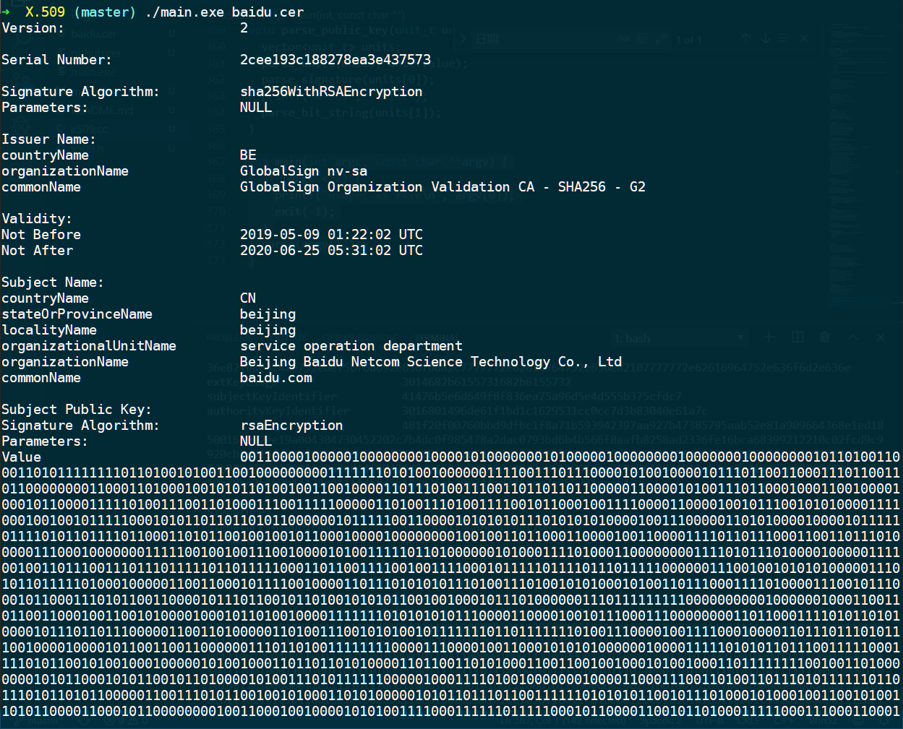
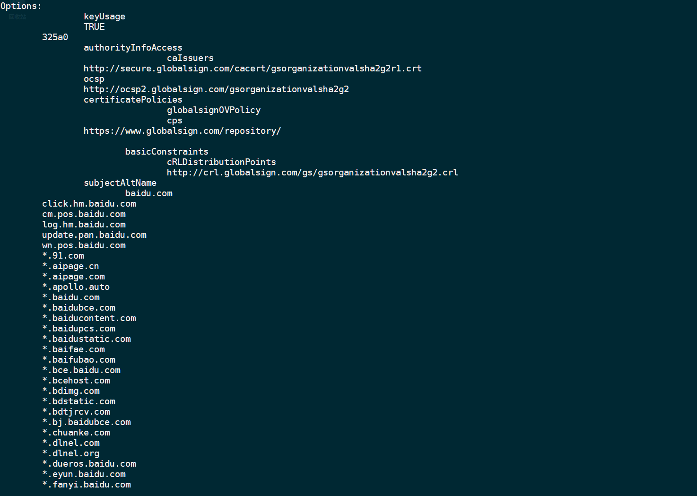
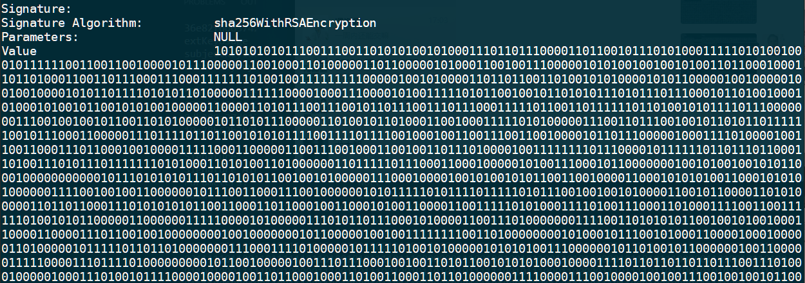
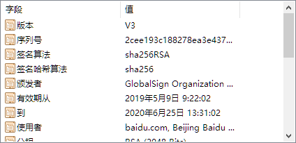
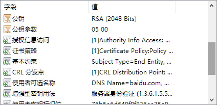

# X.509 数字证书

## 证书结构

X.509证书结构由三部分组成，分别为：证书基本部分，签名算法以及签名。

```ASN.1
Certificate::=SEQUENCE{
    tbsCertificate      TBSCertificate,
    signatureAlgorithm  AlgorithmIdentifier,
    signatureValue      BIT STRING
}
```

### 1 X.509证书基本部分

证书基本部分是一个序列，又包括7个必要部分和3个可选部分组成，必要部分为：版本号、序列号、签名、证书颁发者、有效期、主体、主体公钥信息和颁发者唯一标识符，可选部分为：发行者密钥标识符、主体唯一标识符和扩展部分。

```ASN.1
TBSCertificate::=SEQUENCE{
    version           [0]   EXPLICIT Version DEFAULT v1,
    serialNumber            CertificateSerialNumber,
    signature               AlgorithmIdentifier,
    issuer                  Name,
    validity                Validity,
    subject                 Name,
    subjectPublicKeyInfo    SubjectPublicKeyInfo,
    issuerUniqueID    [1]   IMPLICIT UniqueIdentifier OPTIONAL,
    subjectUniqueID   [2]   IMPLICIT UniqueIdentifier OPTIONAL,
    extensions        [3]   EXPLICIT Extensions OPTIONAL
}
```

#### 1.1 版本号

标识证书的版本（版本1、版本2或是版本3）。

```
Version::=INTEGER {v1(0),v2(1),v3(2)}
```

#### 1.2 序列号

标识证书的唯一整数，由证书颁发者分配的本证书的唯一标识符。

```
CertificateSerialNumber::=INTEGER
```

#### 1.3 签名

用于签证书的算法标识，由对象标识符加上相关的参数组成，用于说明本证书所用的数字签名算法。例如，SHA-1和RSA的对象标识符就用来说明该数字签名是利用RSA对SHA-1杂凑加密。

```
AlgorithmIdentifier::=SEQUENCE{
    algorithm       OBJECT IDENTIFIER,
    parameters      ANY DEFINED BY algorithm OPTIONAL
}
```

#### 1.4 颁发者

证书颁发者的可识别名（DN）。

```
Name::=CHOICE{
    RDNSequence
}
RDNSequence::=SEQUENCE OF RelativeDistinguishedName
RelativeDistinguishedName::=SET OF AttributeTypeAndValue
AttributeTypeAndValue::=SEQUENCE{
    type    AttributeType,
    value   AttributeValue
}
AttributeType::=OBJECT IDENTIFIER
AttributeValue::=ANY DEFINED BY AttributeType
```

#### 1.5 有效期

证书有效期的时间段。本字段由 `Not Before` 和 `Not After` 两项组成，它们分别由UTC时间或一般的时间表示（在RFC2459中有详细的时间表示规则）。

```
Validity::=SEQUENCE{
    notBefore       Time,
    notAfter        Time
}
Time::=CHOICE{
    utcTime         UTCTime,
    generalTime     GeneralizedTime
}
```

#### 1.6 主体

证书拥有者的可识别名，这个字段必须是非空的，除非你在证书扩展中有别名。主体部分的描述与颁发者相同。

#### 1.7 主体公钥信息

主体的公钥（以及算法标识符）。

```
SubjectPublicKeyInfo::=SEQUENCE{
    algorithm           AlgorithmIdentifier,
    subjectPublicKey    BIT STRING
}
```

#### 1.8 颁发者唯一标识符

标识符—证书颁发者的唯一标识符，仅在版本2和版本3中有要求，属于可选项。

```
UniqueIdentifier::=BIT STRING
```

#### 1.9 主体唯一标识符

证书拥有者的唯一标识符，仅在版本2和版本3中有要求，属于可选项。描述与颁发者唯一标识符相同。

### 2 X.509证书扩展部分

扩展部分版本3中使用，其中可能包括：

```
Extension ::= SEQUENCE {
    extnID      OBJECT IDENTIFIER,
    critical    BOOLEAN DEFAULT FALSE,
    extnValue   OCTET STRING
}
```

#### 2.1 发行者密钥标识符

证书所含密钥的唯一标识符，用来区分同一证书拥有者的多对密钥。

#### 2.2 密钥使用

一个比特串，指明（限定）证书的公钥可以完成的功能或服务，如：证书签名、数据加密等。

如果某一证书将 `KeyUsage` 扩展标记为“极重要”，而且设置为 `keyCertSign`，则在 SSL 通信期间该证书出现时将被拒绝，因为该证书扩展表示相关私钥应只用于签写证书，而不应该用于 SSL。

#### 2.3 CRL分布点

指明CRL的分布地点。

#### 2.4 私钥的使用期

指明证书中与公钥相联系的私钥的使用期限，它也有Not Before和Not After组成。若此项不存在时，公私钥的使用期是一样的。

#### 2.5 证书策略

由对象标识符和限定符组成，这些对象标识符说明证书的颁发和使用策略有关。

#### 2.6 策略映射

表明两个CA域之间的一个或多个策略对象标识符的等价关系，仅在CA证书里存在。

#### 2.7 主体别名

指出证书拥有者的别名，如电子邮件地址、IP地址等，别名是和DN绑定在一起的。

#### 2.8 颁发者别名

指出证书颁发者的别名，如电子邮件地址、IP地址等，但颁发者的DN必须出现在证书的颁发者字段。

#### 2.9 主体目录属性

指出证书拥有者的一系列属性。可以使用这一项来传递访问控制信息。

## 数据结构

X.509 证书的结构是用 ASN.1(Abstract Syntax Notation One) 进行描述数据结构，并使用 ASN.1 语法进行编码。证书的整个数据结构由一个个的数据块组成，每个数据块都有四个部分组成：

1. 数据块数据类型标识（1byte）：数据类型包括简单类型和结构类型。简单类型有：整型(INTERGER)、比特串(BIT STRING)、字节串(OCTET STRING)、对象标示符(OBJECT IDENTIFIER)、日期型(UTCTime)等。结构类型由简单类型和结构类型组合而成的，有：顺序类型(SEQUENCE, SEQUENCE OF)、选择类型（CHOICE）、集合类型（SET）等。顺序类型的数据块值由按给定顺序成员成员数据块值按照顺序组成，选择类型的数据块值由多个成员数据数据块类型中选择一个的数据块值，集合数据块类型由成员数据块类型的一个或多个值构成。

2. 数据块长度（1-128bytes）：长度字段有三种编码格式，若长度值小于等于127，则用一个字节表示。否则用多个字节表示，第一个字节的第8位为1，其它低7位给出后面该域使用的字节的数量，从该域第二个字节开始给出数据的长度，高位优先。当第一个字节为0x80时，表示数据块长度不定，由数据块结束标识结束数据块。

3. 数据块的值：存放数据块的值，具体编码随数据块类型不同而不同。

4. 数据块结束标识（可选）：当长度值为不定时使用两个字节（0x0000）来表示字段结束。

### TLV 格式

- 短格式：长度不大于 0x7F，length 字段一个字节，表示 value 字段的长度。
- 长格式：长度大于 0x7F，length 字段一个字节，值为 0x80 与表示 value 字段的长度的值所占用的长度值 `n` 位或运算的结果。然后后面跟 n 个字节与 value 字段。
- 不定长格式：length 字段一个字节，值为 0x80， value 字段由两个字节（0x0000）来表示字段结束。

**数据的类型有较多种，本次实验仅实现了较为常用的部分类型的解析。**

### 布尔类型

- 0x01 Boolean：length 字段一个字节，两种取值：TRUE(0xFF)、FALSE(0x00)。

### 数字类型

- 0x02 Integer

- 0x09 Real

### 字符串类型

- 0x03 BitString

比特串的长度可能不是8的倍数，而DER编码以字节为单位。故而，如果需要，则在比特串的最后填若干位“0”，使其长度达到8的倍数；在最前面增加1字节，写明填充的位数。特别注意：value部分的第一字节，即表示填充位数的那个字节，也要计入数据的总长度。如果不需要填充，则第一字节也需要用00来表示填充位数。 举例：1011010010编码为： 

```
T   L   V
03  03  06  B4　80
```

- 0x04 OctetString

字节码串。举例：AB CD EF 01 23的编码为： 

```
T   L   V
04  05  AB  CD  EF  01  23
```

- 0x0C UTF8String

- 0x12 NumericString

- 0x13 PrintableString

表示任意长度的ASCII字符串。举例：“Hello, world”的编码为： 

```
T   L   V
13  0C  48  65  6C  6C  6F  2C  20  77  6F  72  6C  64
```

- 0x14 TeletexString

- 0x15 VideotexString

- 0x16 IA5String

- 0x19 GraphicString

- 0x1A VisibleString

- 0x1B GeneralString

- 0x1C UniversalString

- 0x1E BMPString

### 空值

- 0x05 NULL

编码是固定的，value部分为空，一共两字节： 

```
T   L
05  00
```

### 对象类型

- 0x06 ObjectDescriptor
- 0x07 ObjectDescriptor

对象标识符（OID），是一个用“.”隔开的非负整数组成的序列。下面说下OID的编码设计：设 $OID=V_1.V_2.V_3.V_4.V_5....V_n$，则DER编码的value部分规则如下：

1. 计算 $40*V_1+V_2$ 作为第一字节；
2. 将 $V_i(i\ge3)$表示为128进制，每一个128进制位作为一个字节，再将除最后一个字节外的所有字节的最高位置1；
3. 依次排列，就得到了value部分。

举例：OID=1.2.840.113549.1.1的编码如下： 

 

$V_i$ 的最后一个字节不对最高位置1，系统以此来识别这里是这个字段的最后一字节。 

### 枚举类型

- 0x0A ENUMERATED

### 时间类型

- 0x17 UTCTime

表示时间，可以用GMT格林威治时间(结尾标“Z”)来表示，或者是用本地时间和相对于GMT的偏移量来表示。 UTCTime的格式如下多种：

- YYMMDDhhmmZ
- YYMMDDhhmm+hh'mm'
- YYMMDDhhmm-hh'mm'
- YYMMDDhhmmssZ
- YYMMDDhhmmss+hh'mm'
- YYMMDDhhmmss-hh'mm'

其中，

- YY：年的最后2位
- MM：月，01-12
- DD：日，01-31
- hh：小时，00-23
- mm：分钟，00-59
- ss：秒，00-59
- Z/+/-：Z表示GMT时间，+/-表示本地时间与GMT时间的差距
- hh’：与GMT的差
- mm’：与GMT的差

举例：北京时间2008年8月8日晚8时表示成UTCTime为：080808120000Z 或 080808200000-0800 其编码为： 

```
T   L   V
17  0D  30  38  30  38  30  38  31  32  30  30  30  30  5A
或
T   L   V
17  11  30  38  30  38  30  38  32  30  30  30  30  30  2D  30  38  30  30
```

- 0x18 GeneralizedTime

与UTCTime类似，差别只在于用4位数字表示“年”，以及“秒”可精确到千分位。举例：北京时间2008年8月8日晚8时1分2.345秒表示成GeneralizedTime为：20080808120102.345Z 或 20080808200102.345-0800 其编码为： 

```
T   L   V
18  13  32  30  30  38  30  38  30  38  31  32  30  31  30  32  2E  33  34  35  5A
或
T   L   V
18  17  32  30  30  38  30  38  30  38  32  30  30  31  30  32  2E  33  34  35  2D  30  38  30  30
```

### 序列

- 0x10 SEQUENCE
- 0x30 SEQUENCE

SEQUENCE与SEQUENCE OF的type相同，都是30。value部分为序列内所有项目的编码的依次排列。length为这些项目编码的总长度。举例：一天中几次温度测量的结果：temperatureInADay SEQUENCE(7) OF INTEGER::={21,15,5,-2,5,10,5}, 其DER编码为： 

```
T   L   V
30  15  02  01  15
        02  01  0F
        02  01  05
        02  01  FE
        02  01  05
        02  01  0A
        02  01  05
```

### 集合

- 0x11 SET
- 0x31 SET

SET和SET OF的type都是31，value部分包括集合内所有项目的编码，length为其总长度。需要注意的是，集合构造类型中的各字段是并列的，逻辑上不分先后，但为了编码的唯一性，在DER编码中，编码的排列是有一定顺序的。SET按标签的顺序排列。举例： 

```
Name::=SET{
    surname     [0] PrintableString,
    mid-name    [1] PrintableString,
    first-name  [2] PrintableString
}
```

编码时则按照surname，mid-name，first-name的顺序。SET OF按字典升序排列，即将各项目的DER结果看做字节码从小到大排列。举例：一天中几次温度测量的结果：temperatureInADay SET(7) OF INTEGER::={21,15,5,-2,5,10,5}, 其DER编码为：

```
T   L   V
30  15  02  01  05
        02  01  05
        02  01  05
        02  01  0A
        02  01  0F
        02  01  15
        02  01  FE
```

### 标签

#### 隐式标签 

DER编码时，添加隐式标签的编码规则为： 对于简单类型，type=80+tag序号；对于构造类型，type=A0+tag序号。length和value不变。 

#### 显式标签

假设time被赋值为UTCTime类型的值080808120000Z，而由于隐式标签的type编码覆盖了表示这一类型的type编码，导致编码时无法判断time究竟是哪种类型，造成混乱，所以这里需要使用显式标签。

显式标签的编码规则为： 

```
T           L                       V
A0+Tag序号  原TLV格式编码的总长度   原TLV格式编码  
```

 即在原编码外再封装一层。 

### OID表

篇幅过大，见 `x509.h` 文件。（收录两千多条目）

## 源代码

### 数据结构定义

先定义 TLV 格式的数据结构。

```c++
typedef uint8_t byte_t;
typedef struct {
  byte_t type;
  int length;
  vector<byte_t> value;
} tlv_t, unit_t;
```

### 函数声明

```c++
void parser_init(vector<byte_t> &bytes, const char *path);
void parse_units(vector<unit_t> &units, vector<byte_t> &bytes);

void parse(unit_t unit);
void parse_boolean(unit_t unit);
void parse_integer(unit_t unit);
void parse_bit_string(unit_t unit);
void parse_octet_string(unit_t unit);
void parse_null(unit_t unit);
void parse_object_identifier(unit_t unit, const char *format);
void parse_printable_string(unit_t unit);
void parse_time(unit_t unit);
void parse_sequence(unit_t unit);
void parse_set(unit_t unit);

void parse(const char *in);
void parse_certificate(unit_t unit);
void parse_tbs_certificate(unit_t unit);
int parse_version(unit_t unit);
void parse_serial_number(unit_t unit);
void parse_signature(unit_t unit);
void parse_signature_algorithm(unit_t unit);
void parse_signature_parameters(unit_t unit);
void parse_entity(unit_t unit);
void parse_entity_attribute(unit_t unit);
void parse_validity(unit_t unit);
void parse_public_key(unit_t unit);
```

### 证书读取

定义读取字节的函数。

```c++
// 读文件并进行初始化
void parser_init(vector<byte_t> &bytes, const char *path) {
  FILE *file = fopen(path, "rb");
  byte_t buf;
  size_t rlen = 0;
  while ((rlen = fread(&buf, sizeof(byte_t), 1, file))) {
    bytes.push_back(buf);
  }
  fclose(file);
}
```

### 提取TLV块

```c++
// 拆分TLV
void parse_units(vector<unit_t> &units, vector<byte_t> &bytes) {
  for (int index = 0; index < bytes.size();) {
    unit_t unit;
    auto &value = unit.value;
    unit.type = bytes[index++];
    byte_t length = bytes[index++];
    int len = length;      // 短格式
    if (length == 0x80) {  // 不定长格式
      byte_t b1, b2;
      while (true) {
        b1 = bytes[index++];
        b2 = bytes[index++];
        if (b1 == 0 && b2 == 0) {  // 判断结束符
          break;
        }
        value.push_back(b1);
        value.push_back(b2);
      }
      unit.length = value.size();
      continue;
    } else if (length > 0x80) {  // 长格式
      len = 0;
      for (int i = 0; i < (length & 0x7f); i++) {
        len = len * 256 + bytes[index++];
      }
    }
    unit.length = len;
    for (int i = 0; i < len; i++) {
      value.push_back(bytes[index++]);
    }
    units.push_back(std::move(unit));
  }
}
```

### 类型解析

```c++
// 解析
void parse(unit_t unit) {
  switch (unit.type) {
    case 0x1:
      parse_boolean(unit);
      break;
    case 0x2:
      parse_integer(unit);
      break;
    case 0x3:
      parse_bit_string(unit);
      break;
    case 0x4:
      parse_octet_string(unit);
      break;
    case 0x5:
      parse_null(unit);
      break;
    case 0x6:
      parse_object_identifier(unit, "%s\n\t");
      break;
    case 0x13:
    case 0x16:
      parse_printable_string(unit);
      break;
    case 0x17:
    case 0x18:
      parse_time(unit);
      break;
    case 0x30:
      parse_sequence(unit);
      break;
    case 0x31:
      parse_set(unit);
      break;
    default:
      if (unit.type >= 0xa0) {
        vector<unit_t> units;
        parse_units(units, unit.value);
        parse(units[0]);
      } else if (unit.type >= 0x80) {
        for (int i = 0; i < unit.value.size(); i++) {
          printf("%c", unit.value[i]);
        }
        puts("");
      } else {
        printf("type error");
        exit(-1);
      }
  }
}

// 0x01 解析布尔型
void parse_boolean(unit_t unit) {
  TYPE(unit, 0x1, "boolean error");
  puts(unit.value[0] ? "TRUE" : "FALSE");
}

// 0x02 解析整数
void parse_integer(unit_t unit) {
  TYPE(unit, 0x2, "integer error");
  for (int i = 0; i < unit.value.size(); i++) {
    printf("%x", unit.value[i]);
  }
  puts("");
}

// 0x03 解析bit字符串
void parse_bit_string(unit_t unit) {
  byte_t pad = unit.value[0];
  unit.value.erase(unit.value.begin());
  if (unit.type == 0x30) {
    parse_sequence(unit);
  } else {
    for (int i = 0; i < unit.length; i++) {
      int n = unit.value[i];
      string s;
      while (n) {
        s.insert(s.begin(), n % 2 + 48);
        n /= 2;
      }
      printf("%08d", atoi(s.c_str()));
    }
    puts("");
  }
}

// 0x04 解析字节字符串
void parse_octet_string(unit_t unit) {
  TYPE(unit, 0x4, "octet_string error");
  if (unit.value[0] != 0x4 && unit.value[0] != 0x30 && unit.value[0] != 0x31) {
    for (int i = 0; i < unit.value.size(); i++) {
      printf("%x", unit.value[i]);
    }
    puts("");
  } else {
    vector<unit_t> units;
    parse_units(units, unit.value);
    for (int i = 0; i < units.size(); i++) {
      parse(units[i]);
    }
  }
}

// 0x05 解析NULL
void parse_null(unit_t unit) {
  TYPE(unit, 0x5, "octet_string error");
  puts("NULL");
}

// 0x06 解析OID
void parse_object_identifier(unit_t unit, const char *format) {
  TYPE(unit, 0x6, "object_identifier error");
  auto &value = unit.value;
  int v2 = value[0] % 40;
  int v1 = (value[0] - v2) / 40;
  char identifier[30];
  memset(identifier, 0, sizeof(char) * 20);
  sprintf(identifier, "%d.%d", v1, v2);
  for (int i = 1; i < value.size();) {
    int n = 0;
    while (value[i] >> 7) {
      n = n * 128 + (value[i++] & 0x7f);
    }
    n = n * 128 + value[i++];
    char buf[20];
    memset(buf, 0, sizeof(char) * 10);
    sprintf(buf, ".%d", n);
    strcat(identifier, buf);
  }
  printf(format, oid_mapping_table[identifier].c_str());
}

// 0x13 解析字符串
void parse_printable_string(unit_t unit) {
  if (unit.type != 0x13 && unit.type != 0xc && unit.type != 0x16) {
    printf("expect: 0x13||0x0c||0x16\nreceive: %xmsg: printable_string\n",
           unit.type, unit.type);
    exit(-1);
  }
  for (int i = 0; i < unit.length; i++) {
    printf("%c", unit.value[i]);
  }
  puts("");
}

// 0x17 解析日期
void parse_time(unit_t unit) {
  auto &value = unit.value;
  vector<int> nums;
  switch (unit.type) {
    case 0x17:
      for (int i = 0; i < 6; i++) {
        nums.push_back((value[i * 2] - '0') * 10 + value[i * 2 + 1] - '0');
      }
      printf("20%02d-%02d-%02d %02d:%02d:%02d UTC\n", nums[0], nums[1], nums[2],
             nums[3], nums[4], nums[5]);
      break;
    case 0x18:
      // TODO
      break;
    default:
      printf("expect: 0x17||0x18\nreceive: %x\nmsg: time error\n", unit.type);
      exit(-1);
  }
}

// 0x30 解析序列
void parse_sequence(unit_t unit) {
  TYPE(unit, 0x30, "sequence error");
  vector<unit_t> units;
  parse_units(units, unit.value);
  for (int i = 0; i < units.size(); i++) {
    printf("\t");
    parse(units[i]);
  }
  // puts("");
}

// 0x31 解析集合
void parse_set(unit_t unit) {
  TYPE(unit, 0x31, "set error");
  vector<unit_t> units;
  parse_units(units, unit.value);
  for (int i = 0; i < units.size(); i++) {
    parse(units[i]);
  }
  puts("");
}
```

### 结构解析

```c++
// 解析程序
void parse(const char *in) {
  vector<byte_t> bytes;
  vector<unit_t> units;
  parser_init(bytes, in);
  parse_units(units, bytes);
  parse_certificate(units[0]);
}

// 解析证书
void parse_certificate(unit_t unit) {
  vector<unit_t> units;
  parse_units(units, unit.value);
  parse_tbs_certificate(units[0]);
  printf("\n%-30s", "Signature:");
  parse_signature(units[1]);
  printf("%-30s", "Value");
  parse_bit_string(units[2]);
}

// 解析证书基本部分
void parse_tbs_certificate(unit_t unit) {
  int i = 0;
  vector<unit_t> units;
  parse_units(units, unit.value);
  printf("%-30s", "Version:");
  if (parse_version(units[i++]) == -1) {  // 使用缺省值
    printf("\n%-30s", "Serial Number:");
    parse_serial_number(units[i]);
  } else {
    printf("\n%-30s", "Serial Number:");
    parse_serial_number(units[i++]);
  }
  parse_signature(units[i++]);
  printf("\n%-30s\n", "Issuer Name:");
  parse_entity(units[i++]);
  printf("\n%-30s\n", "Validity:");
  parse_validity(units[i++]);
  printf("\n%-30s\n", "Subject Name:");
  parse_entity(units[i++]);
  printf("\n%-30s", "Subject Public Key:");
  parse_public_key(units[i++]);
  printf("\n%-30s\n", "Options:");
  while (i < units.size()) {
    parse(units[i++]);
  }
}

// 解析版本号
int parse_version(unit_t unit) {
  if (unit.type != 0xA0) {
    puts("1");
    return -1;  // 使用缺省值
  }
  vector<unit_t> units;
  parse_units(units, unit.value);
  byte_t version = units[0].value[0];
  printf("%d\n", version);
}

// 解析序列数
void parse_serial_number(unit_t unit) {
  if (unit.type != 2) throw 1;
  for (int i = 0; i < unit.value.size(); i++) {
    printf("%02x", unit.value[i]);
  }
  puts("");
}

// 解析签名
void parse_signature(unit_t unit) {
  vector<unit_t> units;
  parse_units(units, unit.value);
  printf("\n%-30s", "Signature Algorithm:");
  parse_signature_algorithm(units[0]);
  printf("%-30s", "Parameters:");
  parse_signature_parameters(units[1]);
}

// 解析签名算法
void parse_signature_algorithm(unit_t unit) {
  parse_object_identifier(unit, "%s\n");
}

// 解析签名算法参数
void parse_signature_parameters(unit_t unit) {
  if (unit.type == 5) {
    puts("NULL");
  } else {
    // TODO
  }
}

// 解析实体
void parse_entity(unit_t unit) {
  vector<unit_t> units;
  parse_units(units, unit.value);
  for (int i = 0; i < units.size(); i++) {
    parse_entity_attribute(units[i]);
  }
}

// 解析实体属性
void parse_entity_attribute(unit_t unit) {
  vector<unit_t> units1, units2;
  parse_units(units1, unit.value);
  parse_units(units2, units1[0].value);
  parse_object_identifier(units2[0], "%-30s");
  parse_printable_string(units2[1]);
}

// 解析有效期
void parse_validity(unit_t unit) {
  vector<unit_t> units;
  parse_units(units, unit.value);
  printf("%-30s", "Not Before");
  parse_time(units[0]);
  printf("%-30s", "Not After");
  parse_time(units[1]);
}

// 解析公钥
void parse_public_key(unit_t unit) {
  vector<unit_t> units;
  parse_units(units, unit.value);
  parse_signature(units[0]);
  printf("%-30s", "Value");
  parse_bit_string(units[1]);
}
```

### 程序入口

```c++
int main(int argc, const char **argv) {
  if (argc < 2) {
    printf("usage: %s file\n", argv[0]);
    exit(-1);
  }
  parse(argv[1]);
}
```

## 编译运行结果

测试使用 [www.baidu.com](www.baidu.com) 网站 DER 编码格式的证书，编译运行结果如下：（部分）

### 运行结果截图







### 原证书信息

|  |  |
| ---------------- | ---------------- |
|                  |                  |
ps：版本号虽然网站上显示v3，但下载下来的证书确实是v2。

